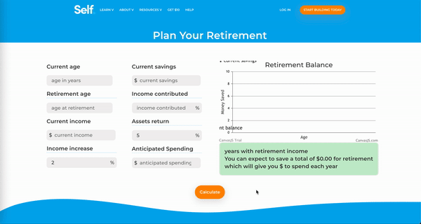

# industry-project

# Objective
A team of three developers were tasked with working together to create a retirement calculator with each showcasing their expertise on a given section, and in the end, have successfully contributed to all parts of the project. This retirement planner calculator will provide the estimated savings at the retirement age that a person desires for our client Self Inc. 

# Designing of our system
The team met weekly and used LucidChart as a main platform to design the calculator and track changes and additions. We then created a presentation to visualize the webpage layout. In order to have the most accurate calculations, we consulted with a professional CPA to have them review our calculations. This data was then translated into JavaScript format using functions. The calculator contains the essential factors of age, annual income, income increase, savings, expenditure, assets, desired retirement age, that are the baseline for the inputs. 

# Development and testing
The form used is HTML and feeds into the JavaScript that will create the retirement outcome which is displayed in the user interface via HTML with styling using CSS. A canvas JS library is used to feed data outputs onto a graph to visualize the results. 

## The testing consists of the following input results: 
- currentAge 
- currentIncome
- incomeIncrease
- incomeContributed
- retirementAge
- retirementSavings
- assestsReturn
- anticipatedSpending

## Output results:
- Balance
- retirementIncomePerYear	
- yearsWithRetirementIncome

# Conclusion 
Our client, Self Inc, helps individuals build their financial journey by utilizing their platform and creating Credit Builder Account. Our calculator will be an addition to their company by adding the value of not only building credit, but also securing a retirement plan and obtaining long term financial stability. 

